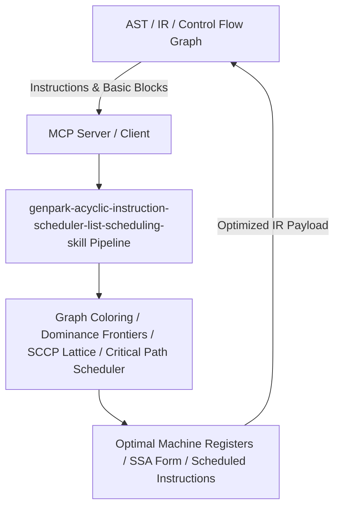

# genpark-acyclic-instruction-scheduler-list-scheduling-skill

[](https://github.com/alphaparkinc/genpark-acyclic-instruction-scheduler-list-scheduling-skill)
[](https://python.org)
[](#)
[](#)
[](LICENSE)

> Critical-path instruction list scheduler optimizing instruction-level parallelism (ILP) and minimizing pipeline bubbles under hardware hazards.

## Architecture Overview



## Features
- **0 External Pip Dependencies**: Pure Python standard library implementation.
- **MCP Protocol Ready**: Includes Model Context Protocol server script (`mcp_server.py`).
- **Production Standard**: Thoroughly tested dominance analysis, register allocation, and peephole rewriting.

## Quick Start
```bash
python example_usage.py
```
